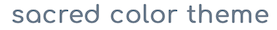
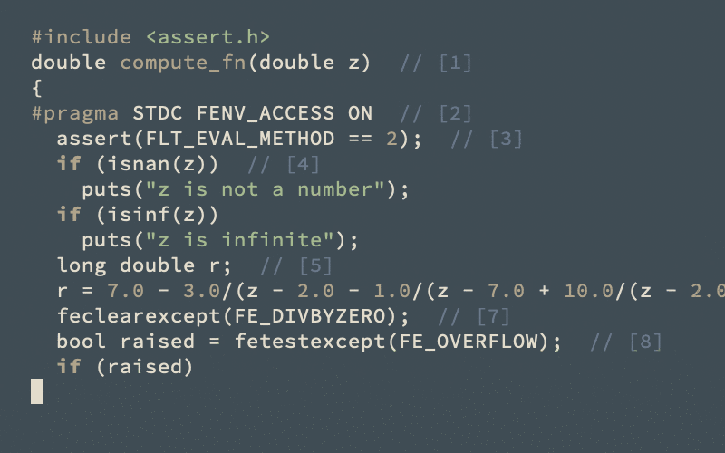
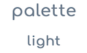
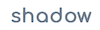
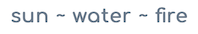
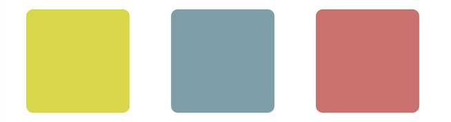
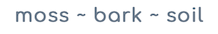
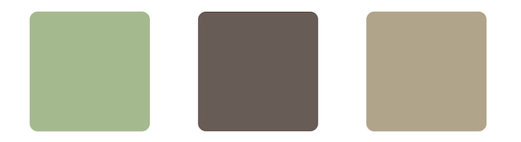
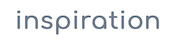

  

    
  

   
   
  

    
  

   
  

  <a href="https://github.com/matthias-margush/sacred-theme">source code</a> ~ <a href="https://matthias-margush.github.io/sacred-theme/index.html">home page</a>
  

   
   
  

    
  

   
  <pre style="background:white">(package-install 'sacred-theme)</pre>
  <pre style="background:white">
   ;; dark
(load-theme 'sacredforest t)

   ;; light
(load-theme 'sacredpaper t)</pre>
   
   
   
  

    
  

   
  

    
  

   
   
  

    
  

   
  

    
  

   
   
  

    
  

   
  

    
  

   
   
  

    
  

   
  

    
  

   
   
  

    
  

   
  

  <a href="https://github.com/KKPMW/sacredforest-vim">sacredforest-vim</a> ~ <a href="https://github.com/nylki/pen-paper-coffee-syntax">pen-paper-coffee-syntax</a> ~ <a href="https://www.nordtheme.com">nord</a>
  

